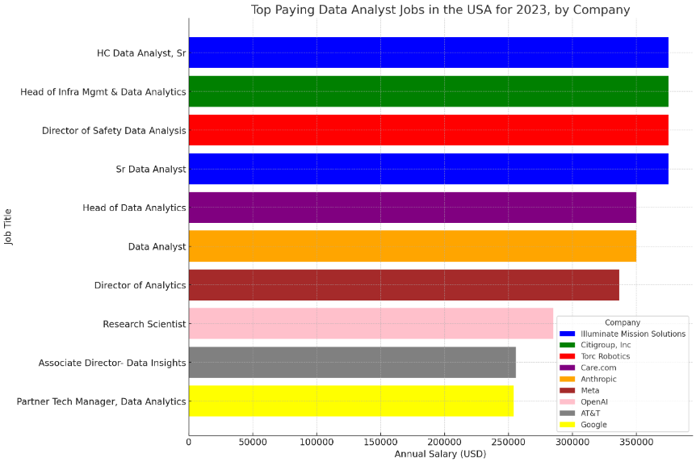
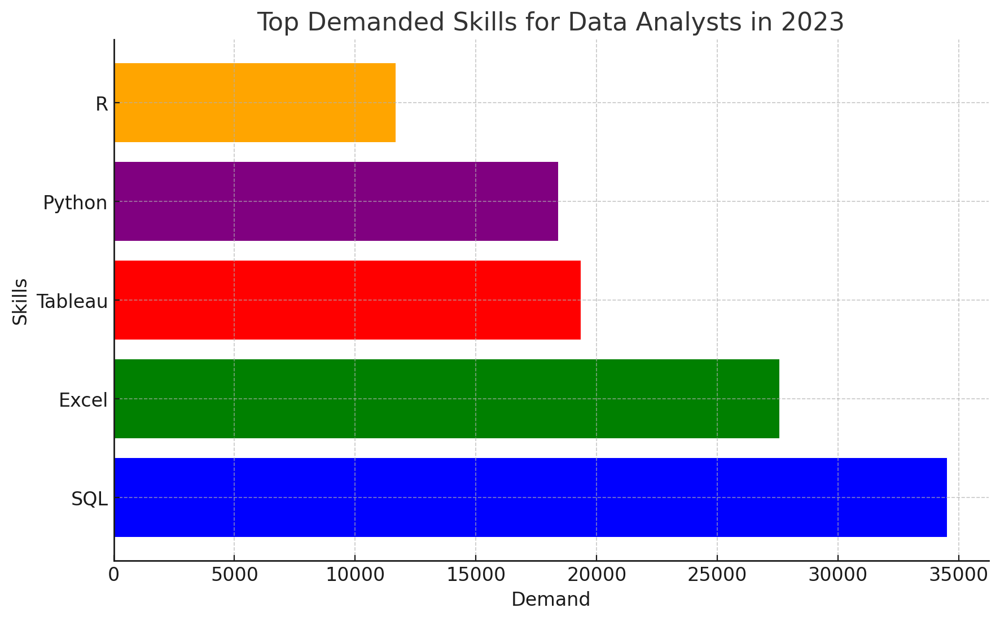
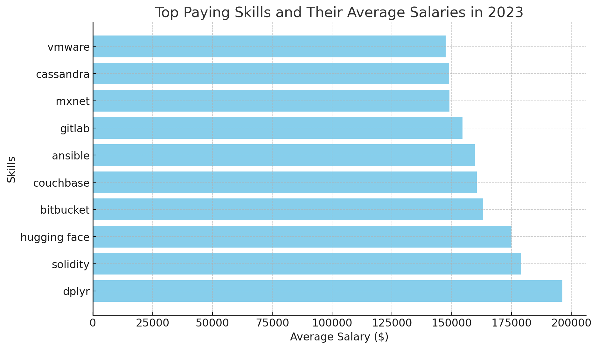

# Introduction
The objective of this project is to examine the data job market, specifically focusing on data analyst positions. It aims to identify the highest-paying jobs, the most in-demand skills, and where high demand intersects with high compensation in the field of data analytics.

🔍 For the SQL queries click here: [project_sql folder](/queries_and_analysis/)
# Background
Motivated by the desire to better understand the data analyst job market, this project was initiated to identify highly paid and sought-after skills, thereby facilitating others in finding the best job opportunities.

The data used comes from Luke Barousse's website: https://www.lukebarousse.com/sql

It is real-world data for the year 2023 and contains job titles, salaries, locations, and essential skills related to different data positions.

### The questions answered through queries:
1. What are the top-paying data analyst jobs?
2. What skills are required for the top-paying jobs?
3. What are the most in-demand skills for data analysts?
4. What are the top skills based on salary?
5. What are the most optimal skills to learn?
# Tools Used
- **SQL**: Fundamental to the analysis, enabling the querying of the database and the discovery of essential insights.
- **PostgreSQL**: The selected RDBMS.
- **Visual Studio Code**: I used the IDE as a tool for editing the database and executing SQL queries.
- **Git & GitHub**: Crucial for version control and distributing my SQL scripts and analysis, facilitating collaboration and monitoring of the project.
# The Analysis
Each of the 5 questions explores an aspect of the data analysis job market in the USA.

### 1. What are the top-paying data analyst jobs?
I joined the main fact table with the dimensional table containing information about the companies (in order to investigate at which companies are those top-paying jobs). Then, I set the filters to include only data analyst jobs in the USA with disclosed salary (non-null values). Finally order the jobs by salary and limit to top 10. 

```sql
 SELECT
    jp_fact.job_id,
    jp_fact.job_title,
    cp_dim.name AS company_name,
    jp_fact.job_schedule_type,
    jp_fact.salary_year_avg,
    jp_fact.job_posted_date
FROM
    job_postings_fact AS jp_fact 
    INNER JOIN company_dim AS cp_dim ON jp_fact.company_id = cp_dim.company_id
WHERE 
    job_country = 'United States'
    AND job_title_short = 'Data Analyst' 
    AND salary_year_avg IS NOT NULL
ORDER BY
    salary_year_avg DESC
LIMIT
    10
```
#### Insights:
- **Highly Competitive Salaries:** The salaries for top positions in data analytics are extremely competitive, with the highest recorded average salary being $375,000 annually for senior roles at Illuminate Mission Solutions and for strategic leadership positions like Head of Infrastructure Management & Data Analytics at Citigroup.
- **Senior and Leadership Roles Command Higher Salaries:** Roles that require significant experience and leadership responsibilities, such as "Director of Safety Data Analysis" and "Head of Data Analytics," command the highest salaries. This suggests a high value placed on data management and strategic decision-making capabilities in large organizations.
- **Diverse Industries:** The top-paying jobs span a variety of industries, from financial services (Citigroup) to technology (Meta, OpenAI) and healthcare (Illuminate Mission Solutions). This indicates the pervasive importance of data analytics across different sectors.
- **Variation in Job Titles and Roles:** There is a significant variation in job titles, from more traditional "Data Analyst" roles to more specialized positions like "Research Scientist" at OpenAI, indicating a broad spectrum of specializations and expertise within the field of data analytics.


*Bar graph visualizes the top 10 highest-paying jobs. The graph was generated from my SQL query results by ChatGPT.*

### 2. What skills are required for the top-paying jobs?
First, I wrapped the top-paying jobs query in a CTE (Common Table Expression). Then, I joined the table with the two dimensions related to skills.

```sql
WITH top_paying_jobs AS (
    SELECT 
        jp_fact.job_id,
        jp_fact.job_title,
        cp_dim.name AS company_name,
        jp_fact.salary_year_avg
    FROM 
        job_postings_fact AS jp_fact
        INNER JOIN company_dim AS cp_dim ON jp_fact.company_id = cp_dim.company_id
    WHERE 
        job_country = 'United States'
        AND job_title_short = 'Data Analyst'
        AND salary_year_avg IS NOT NULL
    ORDER BY 
        salary_year_avg DESC
    LIMIT 
        10
)

SELECT
    top_paying_jobs.*,
    sk_dim.skills
FROM 
    top_paying_jobs
    INNER JOIN skills_job_dim AS skjob_dim ON top_paying_jobs.job_id = skjob_dim.job_id
    INNER JOIN skills_dim AS sk_dim ON skjob_dim.skill_id = sk_dim.skill_id
ORDER BY 
    top_paying_jobs.salary_year_avg DESC  
```
#### Insights:
Most high-paying jobs require proficiency in several data analytics tools and programming languages. Commonly listed skills include:

- **Programming languages** like Python, R, and SQL are frequently mentioned, highlighting their importance in data manipulation and analysis.

- **Data visualization tools** such as Tableau, Power BI, and Excel are also commonly required, emphasizing the need for data analysts to present data insights effectively.

- **Advanced analytics tools** like SAS, MATLAB, Spark, and Airflow are listed for more technical or senior roles, suggesting a need for skills in handling large-scale data processing and advanced analytics.

- **Cloud technologies** like GCP, Azure, and AWS indicate a requirement for knowledge in cloud-based data solutions, reflecting the ongoing shift towards cloud computing in data management.

### 3. What are the most in-demand skills for data analysts?
Here I joined the fact table with the dimensions containing skills data. Filters are set to reflect only USA jobs pertaining to data analyst positions. Then, I aggregated on the skills and ended up with a count for each skill. The key part here is that I take into consideration all jobs and not only the top-paying ones, like in queries 1 and 2. In the end we limit the selection to 5.

```sql
SELECT
    sk_dim.skill_id,
    sk_dim.skills,
    COUNT(skjob_dim.job_id) AS skill_demand
FROM 
    job_postings_fact AS jp_fact
    INNER JOIN skills_job_dim AS skjob_dim ON jp_fact.job_id = skjob_dim.job_id
    INNER JOIN skills_dim AS sk_dim ON skjob_dim.skill_id = sk_dim.skill_id
WHERE
    jp_fact.job_country = 'United States'
    AND jp_fact.job_title_short = 'Data Analyst'
GROUP BY
    sk_dim.skill_id,
    sk_dim.skills
ORDER BY
    skill_demand DESC
LIMIT 5
```

#### Insights:
- **The most common skills encompass a well-established suite of technologies which covers the data analysis process from start to finish:** SQL for data retrieval/processing, Python and Excel primarily for data processing and Power BI, Tableau primarily for data visualization.


*Bar graph visualizes the top 5 jobs which have the most demand. The graph was generated from my SQL query results by ChatGPT.*

### 4. What are the top skills based on salary?
I joined the fact table with the dimensions containing skills data. After inputting the necessary filter, the data is aggregated by the skills field. Finally, I displayed the average salary for each skill. I limit the selection to top 10 skills based on salary.

```sql
SELECT
    sk_dim.skill_id,
    sk_dim.skills,
    ROUND(AVG(jp_fact.salary_year_avg), 0) as avg_salary
FROM 
    job_postings_fact AS jp_fact
    INNER JOIN skills_job_dim AS skjob_dim ON jp_fact.job_id = skjob_dim.job_id
    INNER JOIN skills_dim AS sk_dim ON skjob_dim.skill_id = sk_dim.skill_id
WHERE
    jp_fact.job_country = 'United States'
    AND jp_fact.job_title_short = 'Data Analyst'
    AND jp_fact.salary_year_avg IS NOT NULL
GROUP BY
    sk_dim.skill_id,
    sk_dim.skills
ORDER BY
    avg_salary DESC
LIMIT 10
```

#### Insights:
- **High Value on Specialized Technical Skills:** The skills listed are specialized and not as general as foundational programming or data manipulation tools. This suggests that niche technical expertise commands higher salaries. Skills like Solidity (related to blockchain development), Hugging Face (focused on machine learning models, particularly in natural language processing), and Dplyr (data manipulation in R) are highly specialized and cater to specific industry needs.
- **Database Management Skills Remain Crucial:** The presence of database technologies like Couchbase and Cassandra suggests that there is a significant reward for expertise in managing and optimizing non-traditional databases, which are critical for big data and real-time web applications.


*Bar graph visualizes the top 10 skills based on average salary numbers. The graph was generated from my SQL query results by ChatGPT.*

### 5. What are the most optimal skills to learn? (high demand and high paying)
In this query I am essentially matching average salary per skill data with skill demand data. The key part is I am looking at skills with a demand higher or equal to 5. Only roles with disclosed salaries are taken into account. In the ordering, priority is given to the skill demand.

```sql
SELECT 
    sk_dim.skill_id,
    sk_dim.skills,
    COUNT(skjob_dim.job_id) AS skill_demand,
    ROUND(AVG(jp_fact.salary_year_avg), 0) as avg_salary
FROM 
    job_postings_fact AS jp_fact
    INNER JOIN skills_job_dim AS skjob_dim ON jp_fact.job_id = skjob_dim.job_id
    INNER JOIN skills_dim AS sk_dim ON skjob_dim.skill_id = sk_dim.skill_id
WHERE
    jp_fact.job_country = 'United States'
    AND jp_fact.job_title_short = 'Data Analyst'
    AND jp_fact.salary_year_avg IS NOT NULL
GROUP BY
    sk_dim.skill_id,
    sk_dim.skills
HAVING
   COUNT(skjob_dim.job_id) >= 500
ORDER BY
    avg_salary DESC,
    skill_demand DESC
LIMIT
    10
```
#### Insights:
- **Python and SQL** are the Pillars: Python, with an average salary of $103,390 and a demand of 1,427 job postings, and SQL, with a slightly lower average salary of $97,438 but a higher demand of 2,514 job postings, are clearly fundamental skills for data analysts. These programming languages are essential for data manipulation, processing, and analysis, which are critical components of a data analyst's job.
- **High Demand for Data Visualization Tools:** Tableau and Power BI also feature prominently, with significant demand (1,366 for Tableau and 843 for Power BI) and competitive salaries ($99,496 and $92,981, respectively). This highlights the importance of data visualization skills in translating complex data insights into accessible and actionable intelligence for decision-making.
- **Excel Remains Relevant:** Despite the availability of more advanced analytical tools, Excel's demand remains high (1,812 job postings), though it has the lowest average salary among the listed skills ($87,033). Excel's ubiquity across business functions and its versatility in handling and analyzing data make it a valuable skill for data analysts.

| Skills   | Demand | Average Salary ($) |
|----------|--------|--------------------|
| Python   | 1,427  | 103,390            |
| R        | 893    | 100,292            |
| Tableau  | 1,366  | 99,496             |
| SQL      | 2,514  | 97,438             |
| Power BI | 843    | 92,981             |
| Excel    | 1,812  | 87,033             |

# Conclusions
For individuals looking to enter the data analytics field or enhance their career prospects, focusing on SQL and Python can be particularly beneficial due to their high demand and salary. Additionally, gaining expertise in R and data visualization tools like Tableau and Power BI can further enhance employability and salary potential. For higher salary prospects, more specialized tools (big data platforms, cloud services, and streaming technologies and more) deserve attention.